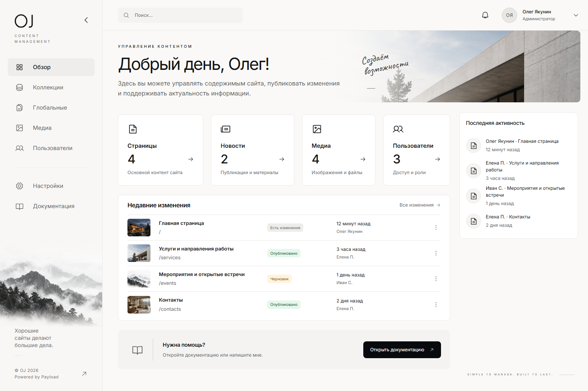
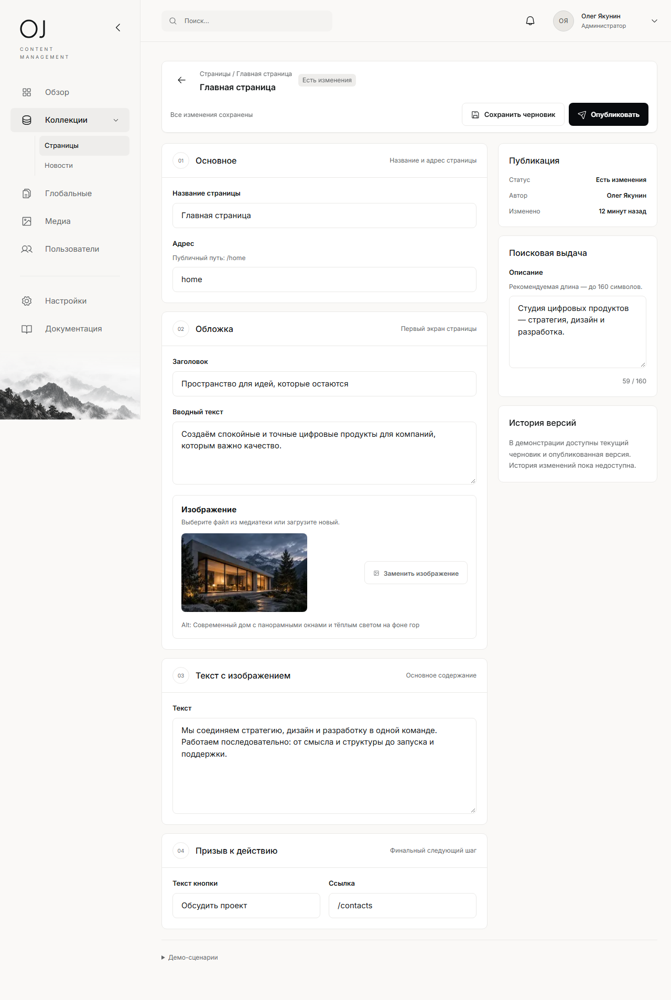
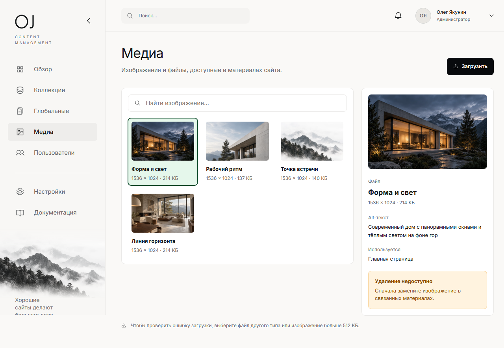

# OJ CMS

### Управление сайтом, которое не нужно объяснять.

**OJ CMS** — авторская система управления контентом от веб-разработчика **Олега Якунина**. Она превращает мощь Payload в спокойный, понятный и красивый рабочий интерфейс для бизнеса.

[Посмотреть живую демонстрацию](https://oj-cms.vercel.app/admin) · [Познакомиться с автором](https://jakuninoleg.dev/ru)

## CMS, в которую приятно заходить

Сайт может быть сложным внутри. Для клиента он не должен быть сложным в работе.

В OJ CMS нет ощущения технической панели, в которой страшно нажать не туда. Здесь всё названо человеческим языком: страницы, новости, изображения, контакты и пользователи. Редактор сразу понимает, где он находится и что сейчас изменено.

Это рабочее пространство для компаний, которым важны порядок, самостоятельность и достойное впечатление от собственного продукта — в том числе после запуска.

## Всё необходимое — на своих местах

- **Страницы и новости** — понятная структура контента без лишних терминов.
- **Черновики и публикация** — изменения можно спокойно сохранить, проверить и только потом показать посетителям.
- **Медиатека** — изображения собраны в одном месте вместе с описаниями и связями.
- **Настройки сайта** — контакты, название и навигация меняются без обращения к разработчику.
- **Роли пользователей** — редакторы работают с контентом, администраторы управляют доступом.
- **Любой экран** — интерфейс остаётся удобным на компьютере, планшете и телефоне.

## Спокойная уверенность вместо страха что-то сломать

OJ CMS показывает состояние каждой публикации простыми словами: **черновик**, **есть изменения**, **опубликовано**. Она предупреждает о несохранённой работе, не теряет введённый текст при ошибке и не позволяет случайно удалить изображение, которое уже используется на сайте.

Каждое действие имеет понятный результат. Именно так управление контентом становится ежедневным инструментом, а не отдельной задачей для технического специалиста.

## Красивый интерфейс поверх Payload

В основе OJ CMS лежит Payload — современная и гибкая платформа для профессиональных веб-проектов. OJ CMS добавляет к ней собственную логику взаимодействия, визуальный язык и опыт, ориентированный на реальных редакторов и владельцев бизнеса.

Каждый проект можно адаптировать под компанию: оставить только нужные разделы, настроить роли, перенести фирменный стиль и собрать понятную структуру именно под её процессы.

В результате клиент получает собственную аккуратную CMS, а не безликую панель с десятками ненужных возможностей.

## Попробуйте сами

Откройте [демонстрацию OJ CMS](https://oj-cms.vercel.app/admin) и пройдите обычный путь редактора:

1. Откройте главную страницу.
2. Измените заголовок или выберите другое изображение.
3. Сохраните черновик.
4. Опубликуйте страницу и посмотрите, как изменился её статус.

Демонстрация показывает именно рабочий интерфейс CMS — без выдуманного публичного сайта. В клиентском проекте к нему подключаются реальные страницы, домен и сценарий предпросмотра. Ваши изменения остаются в браузере и не мешают другим людям знакомиться с продуктом.

## Создано Олегом Якуниным

**Олег Якунин** — веб-разработчик, который проектирует и создаёт цифровые продукты целиком: от идеи, пользовательского сценария и визуальной системы до работающего сайта и дальнейшего развития.

OJ CMS — его подход к клиентским проектам в форме продукта: сильная технология внутри, ясный интерфейс снаружи и внимание к тому, как сайтом будут пользоваться после запуска.

[Сайт Олега Якунина](https://jakuninoleg.dev/ru) · [GitHub](https://github.com/JakuninOleg)

---

### Нужен сайт, которым действительно удобно управлять?

[Посмотрите OJ CMS в работе](https://oj-cms.vercel.app/admin), а затем [расскажите Олегу о своём проекте](https://jakuninoleg.dev/ru).
